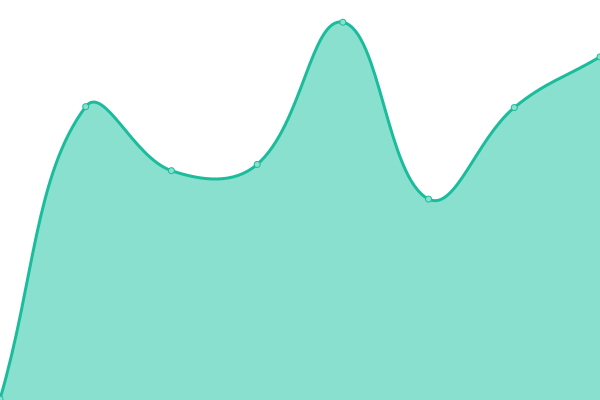

# [📈 Live Status](https://demo.upptime.js.org): <!--live status--> **🟧 Partial outage**

This repository contains the open-source uptime monitor and status page for [椰羊角](https://demo.upptime.js.org), powered by [Upptime](https://github.com/upptime/upptime).

With [Upptime](https://upptime.js.org), you can get your own unlimited and free uptime monitor and status page, powered entirely by a GitHub repository. We use [Issues](https://github.com/CoCoGoat-Network/Uptime/issues) as incident reports, [Actions](https://github.com/CoCoGoat-Network/Uptime/actions) as uptime monitors, and [Pages](https://demo.upptime.js.org) for the status page.

<!--start: status pages-->
<!-- This summary is generated by Upptime (https://github.com/upptime/upptime) -->
<!-- Do not edit this manually, your changes will be overwritten -->
<!-- prettier-ignore -->
| URL | Status | History | Response Time | Uptime |
| --- | ------ | ------- | ------------- | ------ |
|  [Dashboard](https://app.netbird.uno) | 🟥 Down | [dashboard.yml](https://github.com/CoCoGoat-Network/Uptime/commits/HEAD/history/dashboard.yml) | 

 2755ms
     
 | 

<a href="https://status.netbird.uno/history/dashboard">99.99%</a>
    

|  [Management Service](https://app.netbird.uno/api) | 🟥 Down | [management-service.yml](https://github.com/CoCoGoat-Network/Uptime/commits/HEAD/history/management-service.yml) | 

 2516ms
     
 | 

<a href="https://status.netbird.uno/history/management-service">100.00%</a>
    

|  [SSO Service](https://sso.ganyu.rocks/.well-known/openid-configuration) | 🟩 Up | [sso-service.yml](https://github.com/CoCoGoat-Network/Uptime/commits/HEAD/history/sso-service.yml) | 

 956ms
     
 | 

<a href="https://status.netbird.uno/history/sso-service">100.00%</a>
    

|  [STUN Server](stun.netbird.uno) | 🟩 Up | [stun-server.yml](https://github.com/CoCoGoat-Network/Uptime/commits/HEAD/history/stun-server.yml) | 

 233ms
     
 | 

<a href="https://status.netbird.uno/history/stun-server">54.43%</a>
    

|  [Signal Service](signal.netbird.uno) | 🟩 Up | [signal-service.yml](https://github.com/CoCoGoat-Network/Uptime/commits/HEAD/history/signal-service.yml) | 

 170ms
     
 | 

<a href="https://status.netbird.uno/history/signal-service">100.00%</a>
    

|  [Relay Service - Guangzhou](relay.netbird.uno) | 🟩 Up | [relay-service-guangzhou.yml](https://github.com/CoCoGoat-Network/Uptime/commits/HEAD/history/relay-service-guangzhou.yml) | 

 229ms
     
 | 

<a href="https://status.netbird.uno/history/relay-service-guangzhou">99.40%</a>
    

<!--end: status pages-->

[**Visit our status website →**](https://demo.upptime.js.org)

## 📄 License

- Powered by: [Upptime](https://github.com/upptime/upptime)
- Code: [MIT](./LICENSE) © [Anand Chowdhary](https://anandchowdhary.com), supported by [Pabio](https://pabio.com)
- Data in the `./history` directory: [Open Database License](https://opendatacommons.org/licenses/odbl/1-0/)
